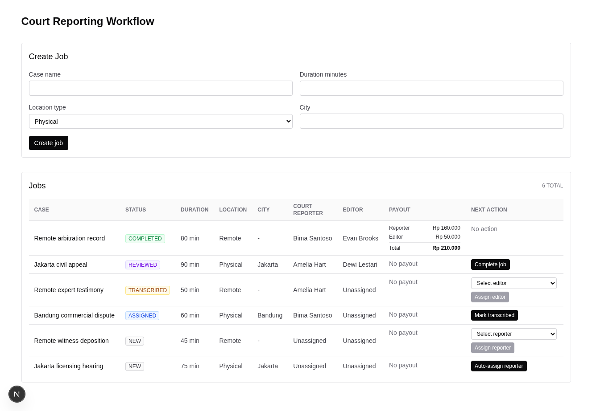

# Court Reporting Workflow Manager

This is my take-home assessment for the VoiceScript fullstack role.

The assessment asks for a simplified court reporting workflow system. A court reporting agency receives audio recordings, creates transcription jobs, assigns court reporters and editors, tracks the job status, and calculates payout for completed work.

I kept the implementation focused on the core workflow. The UI is intentionally simple because the important part of this assessment is whether the system can manage state transitions, assignments, and payout records correctly.

## Assessment Scope

The official assessment asks for:

- job management with `case_name`, duration, location, and status
- reporter assignment
- editor assignment after transcription
- payment calculation
- simple dashboard with job list, status, and assignments
- REST API using Node.js and TypeScript
- any database, with Postgres preferred and SQLite allowed

The role description also emphasizes practical workflow systems, state transitions, real-world business logic, REST APIs, and dashboard interfaces. Because of that, I treated correctness as the main priority here.

## Design Priorities

The main priority is correctness over feature breadth.

For this kind of system the risky part is allowing a job to skip a status, assigning two people into the same slot, creating duplicate payout records, or calculating payout in a way that changes later. So most of the backend work is focused on making the state model explicit and making invalid transitions fail.

The second priority is transparency. I chose a simple stack and direct SQL so the important parts are easy to inspect:

- what data is stored
- which constraints protect the data
- when a job can move to another status
- how concurrent assignment attempts are handled
- when payout records are created

The frontend is built as an operational dashboard. It gives the reviewer enough controls to run the workflow from start to finish, but it does not try to be a polished product UI.

## Implemented Features

- Create physical and remote transcription jobs
- List jobs with status, duration, location, assignments, timestamps, and payout record
- Seed demo data so the dashboard is useful on first load
- Auto-assign court reporters for physical jobs
- Manually assign court reporters for remote jobs
- Assign editors after transcription
- Move jobs through the required workflow
- Calculate and persist payout records when a job is completed
- Prevent duplicate payout records
- Return consistent API error responses
- Backend tests for validation, state transitions, assignment, payout, and concurrency cases

## Demo Workflow

The seeded data already includes jobs in different statuses, including one completed job with a payout record.

A reviewer can also run the full flow manually:

1. Create a transcription job.
2. Assign a court reporter.
3. Mark the job as transcribed.
4. Assign an editor.
5. Mark the job as reviewed.
6. Complete the job.
7. Confirm that the payout record appears in the job list.

## Screenshot

The dashboard starts with seeded jobs across the workflow, including assigned, transcribed, reviewed, and completed examples.



## Tech Stack And Tradeoffs

### Express

I chose Express because the backend requirement is a small REST API. Express keeps the routing simple and leaves the domain logic visible in the code.

For this assessment, I did not want the framework to be the main thing. The important part is the workflow behavior, so a small Express app is enough.

### Direct SQL

I chose to write SQL directly with `better-sqlite3` instead of using an ORM.

The reason is that the important backend behavior here depends on SQL details:

- `CHECK` constraints
- foreign keys
- unique constraints
- joins for the dashboard response
- conditional updates for assignment
- transactions for completion and payout creation

With direct SQL, those decisions are visible. For example, reporter assignment uses an atomic conditional update, so the job is only assigned if it is still `NEW` and does not already have a reporter. This is easier to reason about when the SQL is explicit.

An ORM would also work, but it can hide the exact query behavior. For a small correctness-focused assessment, I prefer making the database behavior clear.

### SQLite

I chose SQLite because it makes the assessment easy to run locally. The reviewer does not need Docker, Postgres setup, or database credentials. The app can reset and seed a local database with one command.

The tradeoff is that SQLite is not what I would choose first for a production multi-operator workflow system. Postgres would be better for production because it has stronger concurrency behavior for multi-writer workloads, richer locking options, stronger migration tooling, better operational visibility, and more advanced constraint/indexing options.

So SQLite is a deliberate assessment choice for setup simplicity. If this became a production service, I would move it to Postgres.

### Next.js And React

I used Next.js and React for the dashboard because the role prefers React/Next.js and the assessment needs frontend/backend integration.

The dashboard focuses on function over design. It shows the workflow, disables obviously invalid actions, displays unavailable staff, and refetches data after mutations. But the backend is still the source of truth because dashboard data can be stale.

## State Management And Validation

The job lifecycle is:

```text
NEW -> ASSIGNED -> TRANSCRIBED -> REVIEWED -> COMPLETED
```

I did not expose a generic "update status" endpoint. Each workflow movement has its own command endpoint, for example `mark-transcribed`, `mark-reviewed`, and `complete`.

I prefer this because each movement can validate the business rule for that specific action. Marking a job as reviewed is not just changing a string from `TRANSCRIBED` to `REVIEWED`. It also means the job must already have an editor. Completing a job is also not just changing the status to `COMPLETED`. It must create a payout record safely.

The backend uses an explicit state machine to define which transition is allowed. A job cannot skip steps, repeat completed steps, or move backward.

Validation happens in more than one place:

- Request payload validation uses Zod.
- Workflow functions validate the current job state before mutation.
- SQL updates include the expected current state in the `WHERE` clause.
- Database constraints protect the stored data.

This is intentional. UI validation is useful for the operator experience, but it is not enough for correctness. The backend should still reject invalid requests if a user has stale data, calls the API directly, or two requests happen at the same time.

For example, marking a job as reviewed requires:

- the job status must be `TRANSCRIBED`
- the job must already have an editor
- the SQL update must still match that state at write time

If the job state changed before the update, the update affects zero rows and the API returns a conflict-style error.

## Database Invariants

The database also protects domain rules.

Some important constraints:

- physical jobs must have a non-empty city
- remote jobs must have `NULL` city
- job status must be one of the allowed values
- status and staff assignment must match each other
- workflow timestamps must match the lifecycle order
- payment total must equal reporter amount plus editor amount
- each completed job can have at most one payout record through `UNIQUE(payments.job_id)`
- foreign keys connect jobs, reporters, editors, and payments

This means the database is not only used as storage. It also helps keep invalid workflow data out of the system.

## Assignment And Concurrency Handling

The reporter assignment flow is designed around atomic conditional updates.

Instead of doing:

1. read job
2. check if it is assignable
3. update job

and trusting that nothing changed in between, the update itself checks the current state:

```sql
UPDATE jobs
SET
  reporter_id = ?,
  status = 'ASSIGNED',
  assigned_at = datetime('now'),
  updated_at = datetime('now')
WHERE id = ?
  AND status = 'NEW'
  AND reporter_id IS NULL
```

If two requests try to assign the same job, only one update can affect the row. The other request gets zero changed rows and is handled as a conflict.

Editor assignment uses the same idea. It only updates the job when the job is still `TRANSCRIBED` and `editor_id IS NULL`.

## Payout Handling

Payout is created only when a job moves from `REVIEWED` to `COMPLETED`.

The current MVP rates are constants:

- reporter: `2000 IDR` per minute
- editor: `50000 IDR` per job

The calculated amounts are stored in the `payments` table. I chose to store the calculated values instead of only calculating them live because payout history should not change if the business later changes the rates.

Completion runs in a database transaction:

1. validate the job can be completed
2. update the job to `COMPLETED`
3. insert the payout record

There is also a unique constraint on `payments.job_id`. This is the final guard so repeated or concurrent completion cannot create duplicate payout records.

## Getting Started

Install dependencies:

```sh
npm install
```

Reset and seed the SQLite database:

```sh
npm run db:reset --workspace backend
```

Run the backend and frontend together:

```sh
npm run dev
```

Open the dashboard:

```text
http://localhost:3000
```

The backend listens on:

```text
http://localhost:3001
```

The frontend proxies `/api/*` to the backend. By default it uses `http://localhost:3001`, or `BACKEND_URL` if provided.

## Database

The default SQLite database path is:

```text
data/voicescript.sqlite
```

To use another database path:

```sh
DATABASE_PATH=/tmp/voicescript.sqlite npm run db:reset --workspace backend
DATABASE_PATH=/tmp/voicescript.sqlite npm run dev:backend
```

The reset command recreates the schema and inserts reviewer-ready seed data:

- reporters in multiple cities
- unavailable reporter
- editors
- unavailable editor
- jobs across all workflow statuses
- one completed job with a payout record

## API Overview

Health:

- `GET /health`

Jobs:

- `POST /jobs`
- `GET /jobs`
- `POST /jobs/:id/assign-reporter`
- `POST /jobs/:id/mark-transcribed`
- `POST /jobs/:id/assign-editor`
- `POST /jobs/:id/mark-reviewed`
- `POST /jobs/:id/complete`

Staffing:

- `GET /reporters`
- `GET /editors`

Error responses use this shape:

```json
{
  "error": {
    "code": "INVALID_JOB_STATUS",
    "message": "Completing a job requires a reviewed job"
  }
}
```

## Testing And Verification

Run the backend tests:

```sh
npm test --workspace backend
```

Run typecheck for all workspaces:

```sh
npm run typecheck
```

Build all workspaces:

```sh
npm run build
```

The backend test suite covers the main correctness cases:

- physical job requires city
- remote job rejects city
- invalid job creation payloads
- allowed and rejected state transitions
- physical reporter assignment preference
- remote reporter assignment validation
- repeated reporter assignment failure
- concurrent reporter assignment
- editor assignment rules
- marking reviewed requires editor
- completion creates one payout record
- repeated completion does not create duplicate payout
- concurrent completion creates at most one payout record
- seeded data includes jobs across the workflow

Manual dashboard verification:

1. Load the dashboard and confirm seeded jobs are visible.
2. Create a physical job.
3. Auto-assign a court reporter.
4. Mark it transcribed.
5. Assign an editor.
6. Mark it reviewed.
7. Complete it.
8. Confirm the payout record appears.

## MVP Tradeoffs

These are intentionally out of scope for this assessment:

- authentication and user accounts
- role-based permissions
- editing or deleting jobs
- reporter/editor availability management UI
- transcript text editing
- realtime updates
- audit log/history
- payment processing
- standalone payment dashboard

I also kept the frontend simple. The assessment says function is more important than design, so the UI is focused on making the workflow testable.

## Production Considerations

If this were becoming a real production system, the first changes I would make are:

- move from SQLite to Postgres
- add proper migration tooling
- add authentication and role-based permissions
- add audit log records for assignment, status changes, and payout creation
- add observability around workflow mutations
- add pagination and filtering for large job lists
- add stronger staff availability and capacity rules
- add idempotency keys or command IDs for payment-related mutations
- add frontend or end-to-end tests for the dashboard flow
- consider realtime updates if multiple operators use the dashboard at the same time

The current implementation is intentionally smaller than that. It is meant to show the core workflow and correctness model clearly.
